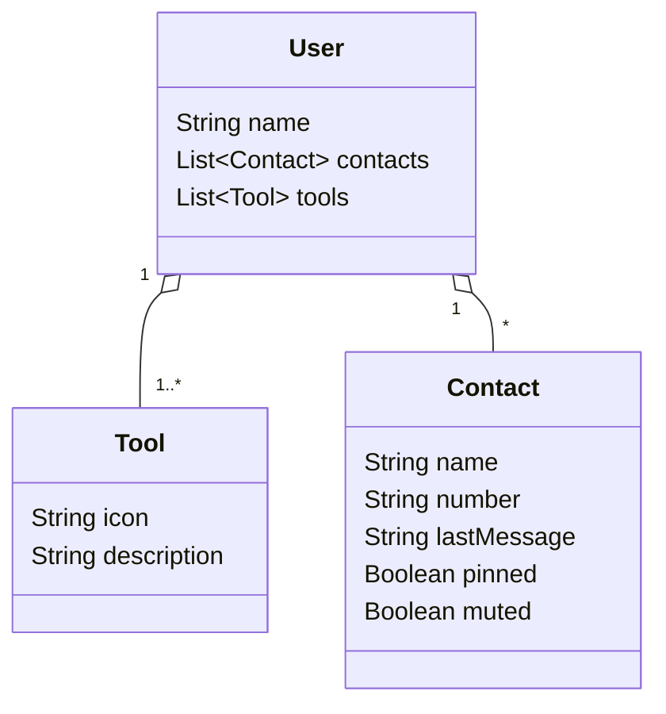

# 📱 ConversaAPI

API REST, inspirada no repositório da [Santander Dev Week 2023](https://github.com/digitalinnovationone/santander-dev-week-2023-api), com foco em um domínio de **aplicativo de conversas**.

A aplicação oferece um CRUD completo para usuários e contatos, com regras de negócio simples, documentação automatizada via Swagger, e boas práticas de estruturação com uso de DTOs e serviços.

---

## 🚀 Funcionalidades

- ✅ Cadastro, listagem, atualização e exclusão de usuários
- ✅ Adição de contatos a um usuário
- ✅ Restrições de negócio aplicadas:
  - Um usuário **não pode ter dois contatos com o mesmo número**
  - Um usuário **deve ter ao menos uma Tool** associada ao ser criado
- ✅ Documentação interativa com Swagger (SpringDoc)
- ✅ Tratamento básico de erros com respostas padronizadas

---

## 🧰 Tecnologias utilizadas

- **Java 21**
- **Spring Boot 3.3.5**
- **Spring Web**
- **Spring Data JPA**
- **H2 Database** (ambiente local)
- **Lombok**
- **SpringDoc OpenAPI** (Swagger)

---

## Diagrama de Classes

